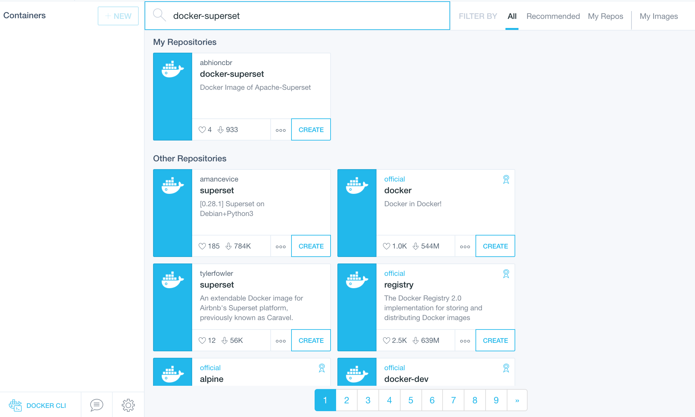
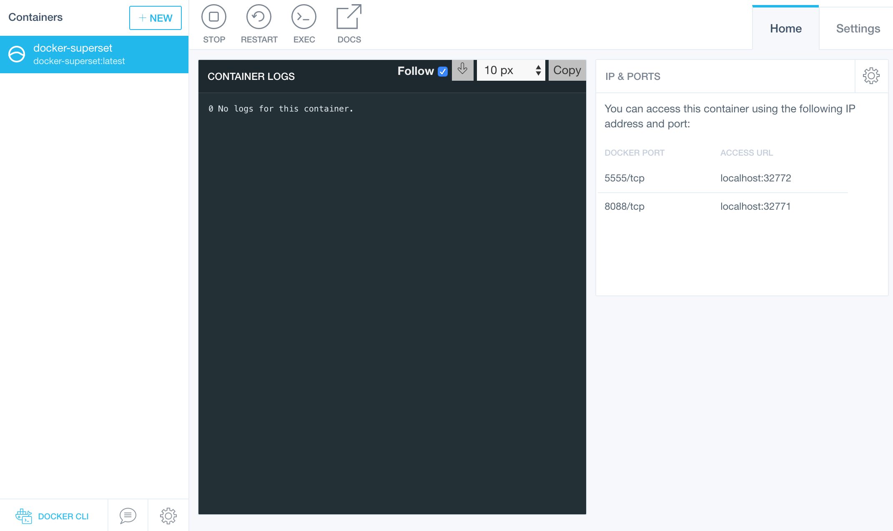
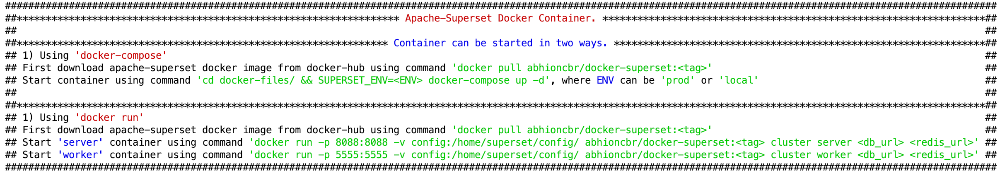

# Inviting contributors for enhancing & maintaing the project. 

# docker-superset
Repository for building [Docker](https://www.docker.com/) container of [Apache Superset](https://superset.incubator.apache.org/tutorial.html).

[](https://superset.incubator.apache.org/tutorial.html)

[](https://circleci.com/gh/abhioncbr/docker-superset/tree/master)
[](http://www.apache.org/licenses/LICENSE-2.0.txt)
[](https://codeclimate.com/github/abhioncbr/docker-superset)
[](http://makeapullrequest.com)

* For understanding & knowing more about Superset, please follow [Official website]((https://superset.incubator.apache.org/tutorial.html)) and [](https://gitter.im/airbnb/superset?utm_source=badge&utm_medium=badge&utm_campaign=pr-badge&utm_content=badge)
* Similarly, for Docker follow [curated list of resources](https://github.com/veggiemonk/awesome-docker).

## Images

|Image|Pulls|Tags|
|:---|:---:|:---:|
|abhioncbr/docker-superset|[](https://cloud.docker.com/u/abhioncbr/repository/docker/abhioncbr/docker-superset)|[tags](https://cloud.docker.com/repository/docker/abhioncbr/docker-superset/tags)|

## Superset components stack
- Enhanced/Modified version of the docker container of [apache-superset](https://github.com/apache/incubator-superset/tree/master/contrib/docker).
- Superset version: Notation for representing version `X.YY.ZZzzz` which means either 
    * 0.34.0, 0.34.0rc1  
    * latest, 0.32.0rc2
    * 0.29.0rc8, 0.29.0rc7, 0.29.0rc5, 0.29.0rc4  
    * 0.28.1, 0.28.0
- Backend database: MySQL
- SqlLabs query async mode: Celery
- Task queue & query cache: Redis
- Image contains all [database plugin dependencies](docker-files/database-dependencies.txt) 

## Superset ports
- superset portal port: 8088
- superset celery flower port: 5555

## Silent features of the docker image
- multiple ways to start a container, i.e. either by using `docker-compose` or by using `docker run` command.
- superset all components, i.e. web application, celery worker, celery flower UI can run in the same container or in different containers.
- container first run sets required database along with examples and the Fabmanager user account with credentials `username: admin & password: admin`.
- superset config file i.e [superset_config.py](config/superset_config.py) should be mounted to the container. **No need to rebuild image for changing configurations.** 
- the default configuration uses MySQL as a Superset metadata database and Redis as a cache & celery broker.
- starting the container using `docker-compose` will start three containers. `mysql5.7` as the database, `redis3.4` as a cache & celery broker and superset container.
    * expects multiple environment variables defined in [docker-compose.yml](docker-files/docker-compose.yml) file. Default environment variables are present in file [`.env`](docker-files/.env). 
    * override default environment variables either by editing `.env` file or passing through commands like `SUPERSET_ENV`.
    * permissible value of `SUPERSET_ENV` can be either `local` or `prod`.
    * in `local` mode one celery worker and superset flask-based superset web application run.
    * in `prod` mode two celery workers and Gunicorn based superset web application run.
 - starting container using `docker run` can be a used for complete distributed setup, requires database & Redis URL for startup.
    * single or multiple server(using load balancer) container can be spawned. In the server, Gunicorn based superset web application runs. 
    * multiple celery workers container running on same or different machines. In worker, celery worker & flower UI runs. 

## How to build the image
   * [DockerFile](docker-files/Dockerfile) uses `superset-version` as a `build-arg`, for example: `0.28.0` or `0.29.0rc4`
   * build image using `docker build` command
        ```shell
        docker build -t abhioncbr/docker-superset:<version-tag> --build-arg SUPERSET_VERSION=<superset-version> -f ~/docker-superset/docker-files/Dockerfile .
        ```
## How to run using Kitmatic
* Simplest way for exploration purpose, using [Kitematic](https://kitematic.com)(Run containers through a simple, yet powerful graphical user interface.) 
    * Search abhioncbr/docker-superset Image on [docker-hub](https://hub.docker.com/r/abhioncbr/docker-superset/) 
        [](Kitematic-search-docker-supeset.png)
    
    * Start a container through Kitematic UI.
        [](Kitematic-start-superset-container.png)    

## How to run using docker commands
* Through general docker commands -
    * first pull a docker-superset image from [docker-hub](https://hub.docker.com/r/abhioncbr/docker-superset/) using either
        ```shell
        docker pull abhioncbr/docker-superset
        ```    
      or for specific superset version by providing version value    
        ```shell
        docker pull abhioncbr/docker-superset:<version-tag>
        ```   
    
    * Copy [superset_config.py](config/superset_config.py), [docker-compose.yml](docker-files/docker-compose.yml), and [.env](docker-files/.env) files. I am considering directory structure like below
        ```
        docker-superset
             |_ config
             |    |_superset_config.py
             |
             |_docker-files
             |    |_docker-compose.yml
             |    |_.env
        
        ```   

    * using `docker-compose`:
        * starting a superset image as a `superset` container in a **local** mode:
            ```shell
            cd docker-superset/docker-files/ && docker-compose up -d
            ```
          or for passing some different environment variables values like below
            ```shell
            cd docker-superset/docker-files/ && SUPERSET_ENV=local SUPERSET_VERSION=<version-tag> docker-compose up -d
            ```           
        
        * starting a superset image as a `superset` container in a **prod** mode:
            ```shell
            cd docker-superset/docker-files/ && SUPERSET_ENV=prod SUPERSET_VERSION=<version-tag> docker-compose up -d
            ```
            
    * using `docker run`:    
        * starting a superset image as a `server` container:
            ```shell
            cd docker-superset && docker run -p 8088:8088 -v config:/home/superset/config/ abhioncbr/docker-superset:<version-tag> cluster server <superset_metadata_db_url> <redis_url>
            ```        
        * starting a superset image as a `worker` container:
            ```shell
             cd docker-superset && docker run -p 5555:5555 -v config:/home/superset/config/ abhioncbr/docker-superset:<version-tag> cluster worker <superset_metadata_db_url> <redis_url>
            ```    
       
    [](docker-superset_execution.png)   
         
## Distributed execution of superset
* As mentioned above, docker image of superset can be leveraged to run in complete distributed run
    * load-balancer in front for routing the request from the client to one server container.
    * multiple docker-superset container in `server` mode for serving the UI of the superset.
    * multiple docker-superset containers in `worker` mode for executing the SQL queries in an async mode using celery executor.
    * centralised Redis container or Redis-cluster for serving as cache layer and celery task queues for workers.
    * centralised superset metadata database.
* Image below depicts the docker-superset distributed platform:
    [](distributed-superset-setup.png)   
